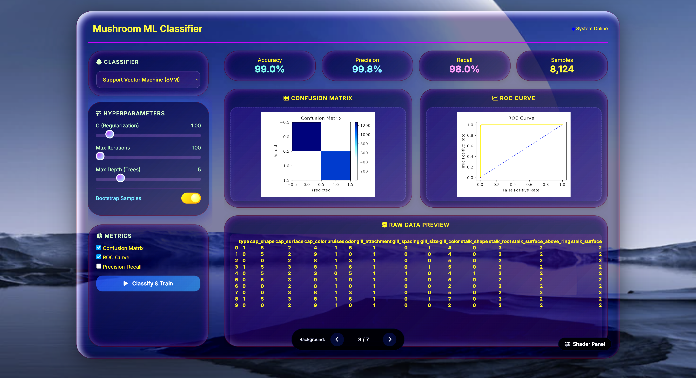
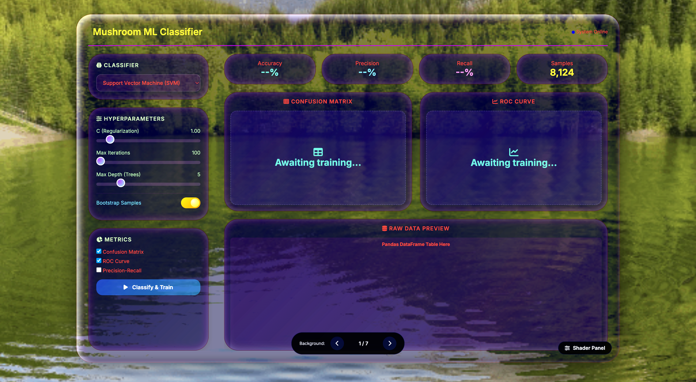
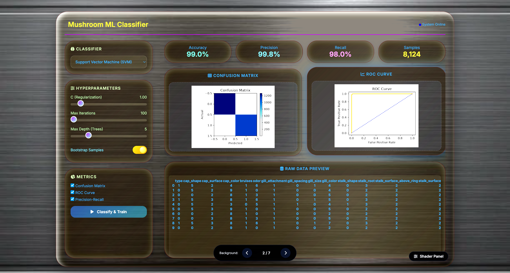
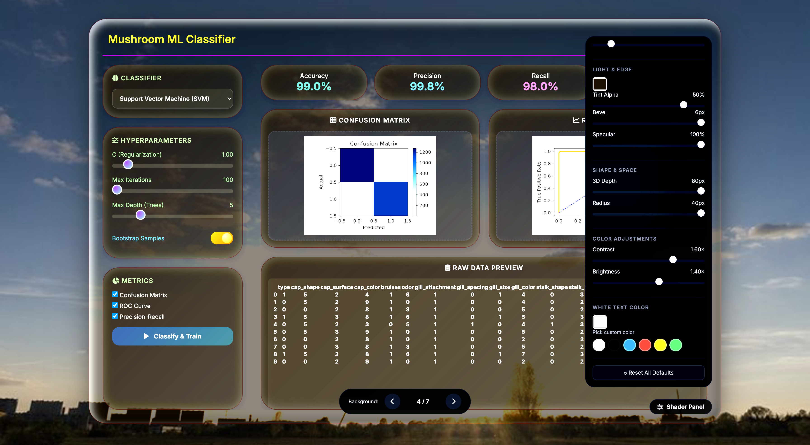

# 🍄 Mushroom ML Classifier

> A **Liquid Glass ML web application** that classifies mushrooms as edible or poisonous using SVM, Logistic Regression, and Random Forest — with real-time trainable metrics and customizable glass effects.

[](https://ml-with-liquid-glass-dashboard.onrender.com)
[](https://www.python.org/)
[](https://scikit-learn.org/)
[](https://flask.palletsprojects.com/)
[](https://www.docker.com/)

---

## 📸 Screenshots

### Full Interface — Live Training in Action


*The complete dashboard: live metrics (Accuracy 99.0%, Precision 99.8%, Recall 98.0%), confusion matrix, ROC curve, hyperparameter controls, and raw data preview — all in one view.*

### Landing View


*The clean starting state before training — upload zone, classifier selector, and metric checkboxes ready to go.*

### Training Results


*Real-time output after clicking "Classify & Train" — confusion matrix, ROC curve, and precision-recall visualization rendered from live scikit-learn output.*

### Liquid Glass Shader Panel


*Full control over the glassmorphism aesthetic: Blur, Frost, Tint, Bevel, Specular, 3D Depth, Radius, Contrast, Brightness, and Text Color — all applied in real time.*

---

## ✨ Features

### 🧠 Machine Learning
- **3 classifiers** — Support Vector Machine, Logistic Regression, Random Forest
- **Hyperparameter tuning** — C (regularization), max iterations, max tree depth
- **Live training** — click "Classify & Train" and watch metrics compute in real time
- **Evaluation metrics** — Accuracy, Precision, Recall on every run
- **Confusion Matrix** — rendered from live scikit-learn output
- **ROC Curve** — True Positive Rate vs False Positive Rate plot
- **Precision-Recall visualization** — toggleable
- **Bootstrap sampling** — optional resampling for variance estimation
- **Raw data preview** — inspect the actual training rows in-app

### 🎨 Liquid Glass UI
- **Live shader panel** — 10 sliders for Blur, Frost, Tint, Bevel, Specular, 3D Depth, Radius, Contrast, Brightness, and Text Color
- **7 switchable backgrounds** — snowy peaks, aurora, desert, forest, and more with smooth crossfades
- **Text color changer** — White / Black / Blue / Red / Yellow / Green
- **Glassmorphism cards** — real-time backdrop blur, 3D depth, hover glow
- **Fully responsive** — works on desktop and mobile

---

## 🏗️ Architecture

```
mushrooms.csv  (8,124 rows × 22 categorical features)
       │
       ▼
┌─────────────────────────────┐
│  Preprocessing               │  ← pandas + sklearn.preprocessing
│  Label-encode categoricals   │
│  Train/test split (80/20)    │
└──────────────┬───────────────┘
               │
        ┌──────┴──────┬──────────────┐
        ▼             ▼              ▼
   ┌─────────┐  ┌──────────┐  ┌──────────────┐
   │   SVM   │  │ Logistic │  │ Random Forest│
   │         │  │Regression│  │              │
   └────┬────┘  └────┬─────┘  └──────┬───────┘
        │            │               │
        └────────────┼───────────────┘
                     ▼
        ┌────────────────────────┐
        │  Evaluation            │
        │  Accuracy · Precision  │
        │  Recall · ROC · CM     │
        └────────────┬───────────┘
                     ▼
           JSON → Flask → Browser
                     │
                     ▼
        Liquid Glass dashboard renders
        charts, metrics, and raw data
        via matplotlib + vanilla JS
```

**Backend:** Flask · scikit-learn · pandas · matplotlib
**Dataset:** UCI Mushroom Dataset (8,124 samples, 22 categorical features)
**Frontend:** Vanilla HTML/CSS/JS · single-page Liquid Glass UI with no build step
**Deployment:** Docker → Render

---

## 🛠️ Tech Stack

| Layer | Technology | Purpose |
|---|---|---|
| **Backend** | Python 3.11 | Runtime |
| **Web framework** | Flask 3.1 | REST API + HTML serving |
| **ML** | scikit-learn 1.9 | SVM, Logistic Regression, Random Forest |
| **Data** | pandas | CSV loading, preprocessing, encoding |
| **Charts** | matplotlib | Confusion matrix, ROC, precision-recall plots |
| **Frontend** | HTML / CSS / vanilla JS | Liquid Glass single-page UI |
| **Deployment** | Docker → Render | Container build + free-tier hosting |

---

## 📊 Dataset

**UCI Mushroom Dataset**

- **Source:** [UCI Machine Learning Repository](https://archive.ics.uci.edu/dataset/73/mushroom)
- **Samples:** 8,124 mushrooms
- **Features:** 22 categorical (cap shape, cap surface, gill color, stalk root, ring type, etc.)
- **Target:** Edible (e) vs Poisonous (p)
- **Class balance:** ~52% edible · ~48% poisonous

The dataset is famously **linearly separable**, which is why even a simple model hits ~99% accuracy. The interesting part is the *interaction* — how SVM, Logistic Regression, and Random Forest differ in their decision boundaries and ROC curves on the same data.

---

## 🚀 Local Setup

```bash
# 1. Clone
git clone https://github.com/olalekanijagbemi-VR/ML_With_Liquid_Glass_Dashboard.git
cd ML_With_Liquid_Glass_Dashboard

# 2. Create virtualenv
python3 -m venv venv
source venv/bin/activate

# 3. Install dependencies
pip install -r requirements.txt

# 4. Run
python app.py
```

Open **http://127.0.0.1:5001**

No API keys required — the dataset ships with the repo and everything runs locally.

---

## ☁️ Deployment (Render)

This repo ships with a `Dockerfile` — Render auto-detects it as Docker runtime.

1. Push to GitHub
2. Render → **New +** → **Web Service** → connect repo
3. Settings:
   - **Runtime:** Docker (auto-detected)
   - **Instance Type:** Free
   - **Environment Variables:** *(none required)*
4. Deploy

**Free tier caveats:**
- App sleeps after 15 min inactivity → ~50s cold start on first request
- Training runs in-process — larger datasets would need background workers

---

## 📁 Project Structure

```
ML_With_Liquid_Glass_Dashboard/
├── app.py                      # Flask backend — /train, /metrics, /data
├── Dockerfile
├── requirements.txt
├── mushrooms.csv               # UCI dataset (8,124 rows)
├── README.md
├── screenshots/                # README assets
│   ├── summary.png
│   ├── dashboard.png
│   ├── results.png
│   └── shader_panel.png
└── static/
    ├── ml-dashboard.html       # Liquid Glass single-page UI
    └── images/                 # Background images
```

---

## 🎯 Roadmap

- [ ] Add K-Nearest Neighbors and Gradient Boosting
- [ ] Cross-validation with k-fold splits
- [ ] Feature importance ranking (permutation importance)
- [ ] Model persistence — save trained pickles, reload without retraining
- [ ] Upload-your-own CSV — classify arbitrary mushroom-shaped datasets
- [ ] Confusion matrix heatmap with adjustable thresholds

---

## 📄 License

MIT — see [LICENSE](LICENSE) for details.

---

## 🙌 Credits

Built by **Olalekan Ijagbemi** — [GitHub](https://github.com/olalekanijagbemi-VR) · [LinkedIn](https://linkedin.com/in/olalekan-ijagbemi-95a1b2269)

---

## 🎯 More Projects

This is part of a 3-project ML portfolio:

1. **🍄 Mushroom ML Classifier** ← *this repo*
   - [GitHub](https://github.com/olalekanijagbemi-VR/ML_With_Liquid_Glass_Dashboard) · [Live Demo](https://ml-with-liquid-glass-dashboard.onrender.com)
   - Classic ML classification with a Liquid Glass dashboard

2. **📊 Universal CSV Analyzer**
   - [GitHub](https://github.com/olalekanijagbemi-VR/Universal_CSV_Analyzer) · [Live Demo](https://universal-csv-analyzer.onrender.com)
   - Automatic data profiling and visualization

3. **🎨 Metal Liquid RAG Assistant**
   - [GitHub](https://github.com/olalekanijagbemi-VR/Metal_Liquid_Dashboard-Rag_Assistant) · [Live Demo](https://metal-liquid-dashboard-rag-assistant.onrender.com)
   - Hybrid retrieval + voice I/O with a Liquid Metal UI